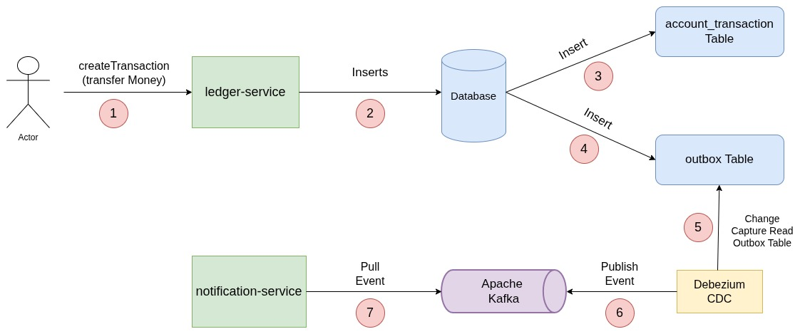
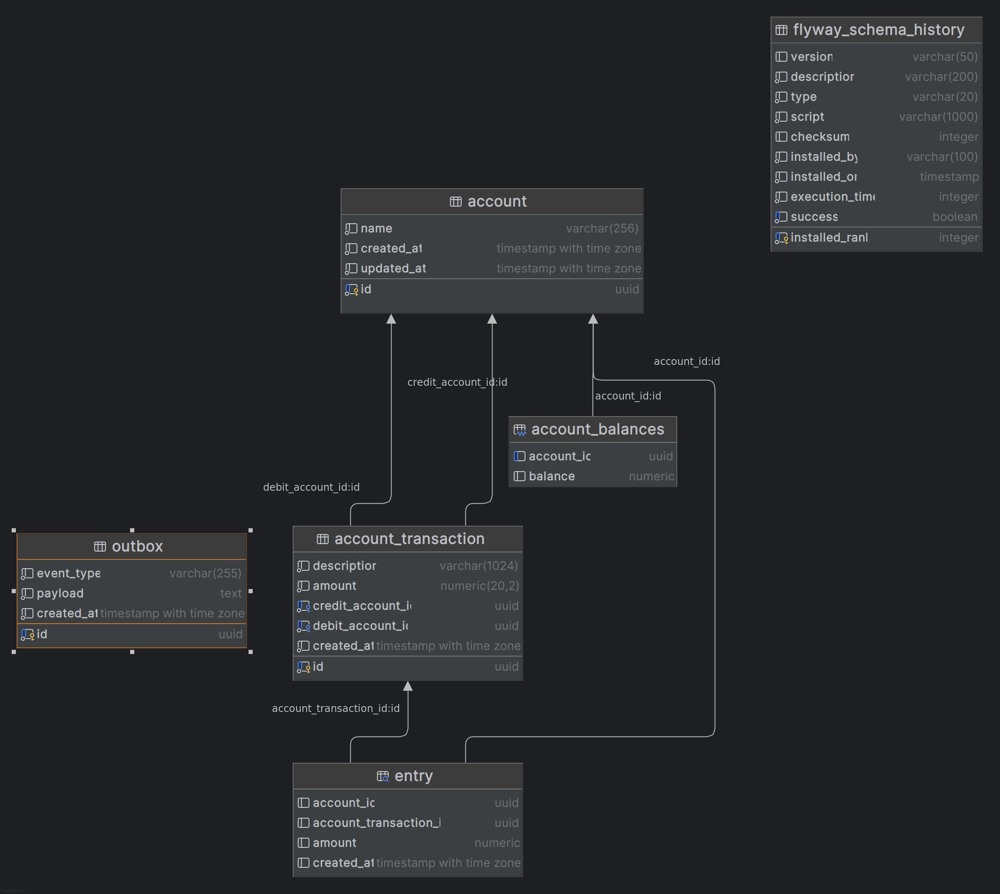

# Bank services using Transactional Outbox Pattern with Debezium and Kafka


## Overview

This project is implemented using the Transactional Outbox Pattern with Spring Boot 4, Debezium, and Apache Kafka. It includes two main services:

- **Ledger Service**: Responsible for creating the account transaction and writing events to the Outbox table.
- **Notification Service**: Consumes events from Kafka to process notifications.

The pattern ensures that changes made in the database (like creating an account transaction) are reliably communicated to other services, even in the case of failures or retries.

## Architecture

1. **Ledger Service**:
    - Handles account transaction creation.
    - Writes events to the Outbox table within the same transaction as the account transaction creation.

2. **Debezium/Ledger Service**:
    - Monitors changes to the Outbox table.
    - Streams changes to Kafka.

3. **Kafka**:
    - Acts as the message broker.
    - Receives events from Debezium and delivers them to the Notification Service.

4. **Notification Service**:
    - Consumes events from Kafka.
    - Processes notifications based on the events received.

## Database Schema
The database schema includes following tables and views:
- `account_transaction` table: Stores account transaction details (money transfer between accounts).
- `outbox` table: Stores events to be processed by other services.
- `entry` view: A view that show each entry(debit and credit account) from `account_transaction`.
- `account_balance` view: A view that shows the current balance of each account.
- `flyway_schema_history` table: Used by Flyway to track database migrations.
  

## Getting Started
### Prerequisites
- Java 25
- Maven 3.9+
- Docker and Docker Compose

### Running the Services with Docker Compose
#### Start ledger-service, postgres, kafka, zookeeper and debezium connector:
```bash
cd ledger-service
mvn spring-boot:run
```
#### Start notification-service:
```bash
cd notification-service
mvn spring-boot:run
```

### Testing the Setup
You can test the setup by sending a POST request to create an account transaction:
```bash
curl -X POST http://localhost:8081/ledger-service/api/v1/transactions \
-H "Content-Type: application/json" \
-d '{
  "debitAccountId": "a7b7b3f0-9b6b-4b1f-8b3f-7b1b3b1f0b3a",
  "creditAccountId": "c3b3b3f0-9b6b-4b1f-8b3f-7b1b3b1f0b3c",
  "amount": 10.00
}'
```     
This will create an account transaction in the Ledger Service, which will write an event to the Outbox table. Debezium will capture this change and send it to Kafka, where the Notification Service will consume it and process the notification.

## TODOs
- Implement unit and integration tests for both services.
- Add more endpoints for additional functionalities like check the account balance, etc.
- Add business validations like sufficient balance to allow transfer account, etc. 